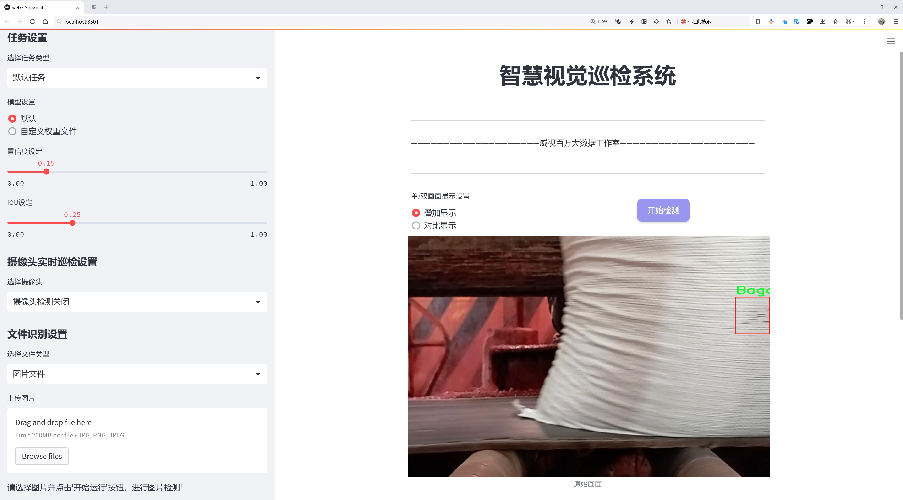
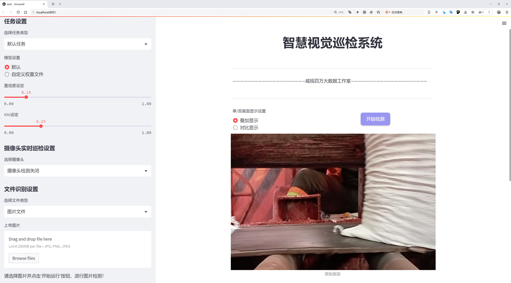
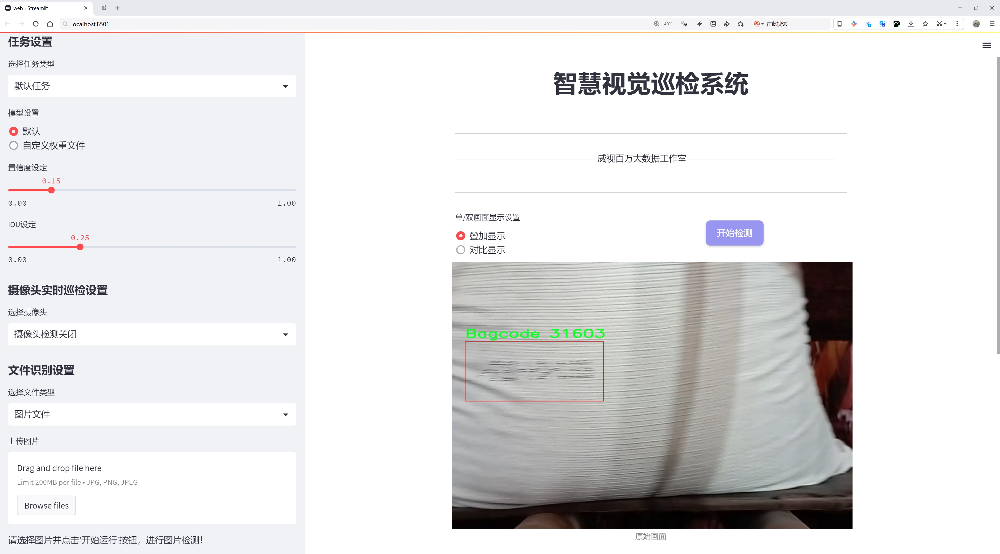
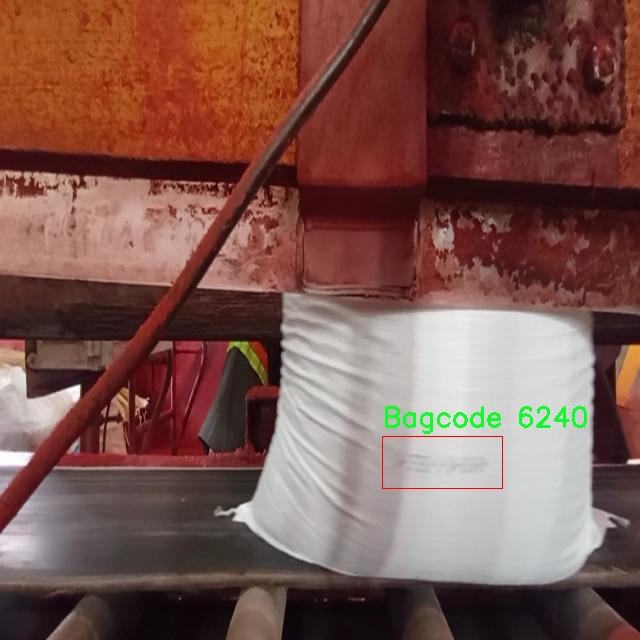
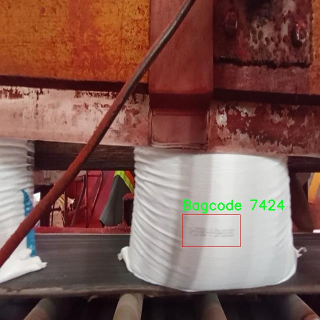
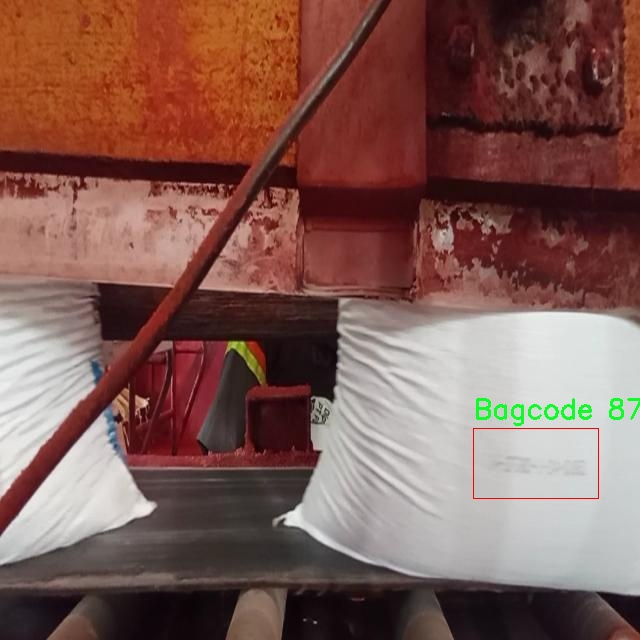
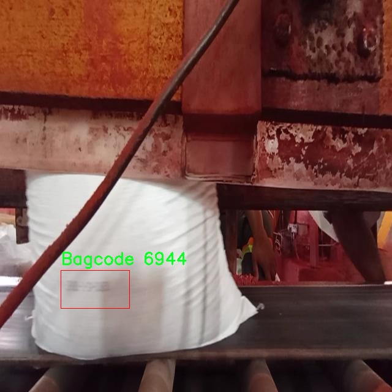
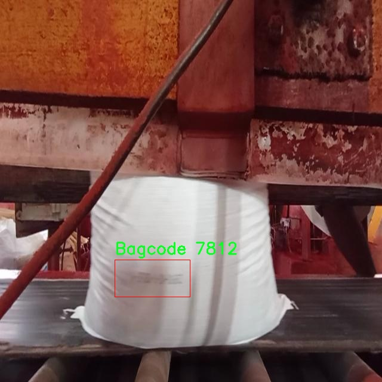

# 编织袋生产线喷码检测检测系统源码分享
 # [一条龙教学YOLOV8标注好的数据集一键训练_70+全套改进创新点发刊_Web前端展示]

### 1.研究背景与意义

项目参考[AAAI Association for the Advancement of Artificial Intelligence](https://gitee.com/qunshansj/projects)

项目来源[AACV Association for the Advancement of Computer Vision](https://gitee.com/qunmasj/projects)

研究背景与意义

随着全球经济的快速发展和市场竞争的日益激烈，制造业的自动化和智能化已成为提升生产效率和产品质量的重要手段。在这一背景下，喷码检测作为生产线质量控制的重要环节，逐渐受到重视。喷码检测不仅能够确保产品信息的准确性和可追溯性，还能有效减少因标识错误导致的经济损失。因此，开发一套高效、准确的喷码检测系统，对于提升编织袋生产线的整体效率和产品质量具有重要意义。

在编织袋生产过程中，喷码是对产品进行标识的重要步骤，通常用于打印生产日期、批次号、条形码等信息。然而，传统的人工检测方法存在效率低、易出错等缺陷，难以满足现代化生产的需求。基于计算机视觉和深度学习技术的自动化检测系统，能够通过图像识别技术快速、准确地识别喷码信息，显著提高检测效率和准确性。YOLO（You Only Look Once）系列算法因其高效的实时目标检测能力，已广泛应用于各类视觉检测任务中。

本研究基于改进的YOLOv8算法，旨在构建一套针对编织袋生产线的喷码检测系统。YOLOv8作为YOLO系列的最新版本，具备更高的检测精度和更快的处理速度，能够在复杂的生产环境中实现实时检测。通过对YOLOv8算法的改进，结合编织袋喷码的特征，我们将提升其在特定应用场景下的检测性能。

本研究所使用的数据集包含1636张图像，涵盖了喷码检测所需的唯一类别“Bagcode”。该数据集的构建不仅为算法的训练提供了丰富的样本，也为后续的模型评估和优化奠定了基础。通过对该数据集的深入分析，我们可以识别出喷码在不同光照、角度和背景下的变化特征，从而进一步优化检测算法的鲁棒性和适应性。

此外，研究的意义还体现在推动智能制造的发展。随着工业4.0的推进，智能化生产已成为制造业的未来趋势。通过引入先进的计算机视觉技术和深度学习算法，喷码检测系统的自动化程度将大幅提升，进而促进整个生产线的智能化升级。这不仅有助于提高生产效率，降低人力成本，还能增强企业在市场中的竞争力。

综上所述，基于改进YOLOv8的编织袋生产线喷码检测系统的研究，不仅具有重要的理论价值，还具备广泛的实际应用前景。通过实现高效、准确的喷码检测，我们将为编织袋生产企业提供一种创新的解决方案，助力其在激烈的市场竞争中立于不败之地。

### 2.图片演示







##### 注意：由于此博客编辑较早，上面“2.图片演示”和“3.视频演示”展示的系统图片或者视频可能为老版本，新版本在老版本的基础上升级如下：（实际效果以升级的新版本为准）

  （1）适配了YOLOV8的“目标检测”模型和“实例分割”模型，通过加载相应的权重（.pt）文件即可自适应加载模型。

  （2）支持“图片识别”、“视频识别”、“摄像头实时识别”三种识别模式。

  （3）支持“图片识别”、“视频识别”、“摄像头实时识别”三种识别结果保存导出，解决手动导出（容易卡顿出现爆内存）存在的问题，识别完自动保存结果并导出到tempDir中。

  （4）支持Web前端系统中的标题、背景图等自定义修改，后面提供修改教程。

  另外本项目提供训练的数据集和训练教程,暂不提供权重文件（best.pt）,需要您按照教程进行训练后实现图片演示和Web前端界面演示的效果。

### 3.视频演示

[3.1 视频演示](https://www.bilibili.com/video/BV1Er4neSELB/)

### 4.数据集信息展示

##### 4.1 本项目数据集详细数据（类别数＆类别名）

nc: 1
names: ['Bagcode']


##### 4.2 本项目数据集信息介绍

数据集信息展示

在现代工业生产中，喷码检测系统的准确性和效率至关重要，尤其是在编织袋生产线中。为此，我们构建了一个专门的数据集，名为“CAMERA EWS BAGCODING”，旨在为改进YOLOv8模型提供高质量的训练数据，以实现对编织袋上喷码的精准检测。该数据集专注于一个特定的类别，即“Bagcode”，并包含了多种不同环境和条件下的图像样本，以确保模型的泛化能力和鲁棒性。

“CAMERA EWS BAGCODING”数据集的设计理念是通过多样化的图像捕捉，涵盖编织袋生产线的不同阶段和不同光照条件，从而提高喷码检测的准确性。数据集中包含的图像均为高分辨率，确保在不同的检测距离和角度下，喷码的细节能够被清晰捕捉。通过这种方式，我们能够为YOLOv8模型提供丰富的特征信息，使其在实际应用中能够更好地识别和分类喷码。

数据集的构建过程经过了严格的筛选和标注，确保每一张图像都经过精确的人工标注，标注过程中不仅考虑了喷码的清晰度，还考虑了背景的复杂性和干扰因素。为了模拟真实的生产环境，数据集中包含了不同类型的编织袋、不同的喷码样式以及各种可能的干扰物。这种多样性使得模型在训练过程中能够学习到更多的特征，从而提高其在实际应用中的表现。

在数据集的使用过程中，我们采用了数据增强技术，以进一步提升模型的训练效果。通过对图像进行旋转、缩放、裁剪和颜色调整等操作，我们能够生成更多的训练样本，帮助模型更好地适应不同的环境变化。这种方法不仅增加了数据集的有效样本数量，还提高了模型的鲁棒性，使其在面对不同生产条件时能够保持高效的检测能力。

此外，为了确保数据集的实用性和有效性，我们在多个实际生产线中进行了测试，收集了反馈并不断优化数据集的构建。通过与行业专家的合作，我们确保数据集能够满足实际应用的需求，帮助企业在喷码检测方面实现更高的自动化和智能化水平。

总之，“CAMERA EWS BAGCODING”数据集的构建不仅为改进YOLOv8模型提供了坚实的基础，也为编织袋生产线的喷码检测系统的智能化发展铺平了道路。随着技术的不断进步和数据集的不断完善，我们相信这一数据集将在未来的工业应用中发挥重要作用，推动喷码检测技术的革新与发展。











### 5.全套项目环境部署视频教程（零基础手把手教学）

[5.1 环境部署教程链接（零基础手把手教学）](https://www.ixigua.com/7404473917358506534?logTag=c807d0cbc21c0ef59de5)


[5.2 安装Python虚拟环境创建和依赖库安装视频教程链接（零基础手把手教学）](https://www.ixigua.com/7404474678003106304?logTag=1f1041108cd1f708b01a)

### 6.手把手YOLOV8训练视频教程（零基础小白有手就能学会）

[6.1 手把手YOLOV8训练视频教程（零基础小白有手就能学会）](https://www.ixigua.com/7404477157818401292?logTag=d31a2dfd1983c9668658)

### 7.70+种全套YOLOV8创新点代码加载调参视频教程（一键加载写好的改进模型的配置文件）

[7.1 70+种全套YOLOV8创新点代码加载调参视频教程（一键加载写好的改进模型的配置文件）](https://www.ixigua.com/7404478314661806627?logTag=29066f8288e3f4eea3a4)

### 8.70+种全套YOLOV8创新点原理讲解（非科班也可以轻松写刊发刊，V10版本正在科研待更新）

由于篇幅限制，每个创新点的具体原理讲解就不一一展开，具体见下列网址中的创新点对应子项目的技术原理博客网址【Blog】：


[8.1 70+种全套YOLOV8创新点原理讲解链接](https://gitee.com/qunmasj/good)

### 9.系统功能展示（检测对象为举例，实际内容以本项目数据集为准）

图9.1.系统支持检测结果表格显示

  图9.2.系统支持置信度和IOU阈值手动调节

  图9.3.系统支持自定义加载权重文件best.pt(需要你通过步骤5中训练获得)

  图9.4.系统支持摄像头实时识别

  图9.5.系统支持图片识别

  图9.6.系统支持视频识别

  图9.7.系统支持识别结果文件自动保存

  图9.8.系统支持Excel导出检测结果数据


### 10.原始YOLOV8算法原理

原始YOLOv8算法原理

YOLOv8是由Ultralytics公司于2023年发布的最新目标检测算法，作为YOLO系列的又一重要进展，YOLOv8在设计理念和技术实现上都进行了深刻的创新和优化。其核心目标是实现更快、更准确的目标检测，适应多种应用场景，满足不同用户的需求。YOLOv8n作为该系列中的一个小型版本，尤其适合在资源受限的环境中运行，展现了出色的性能和灵活性。

在YOLOv8的设计中，输入层是其关键组成部分之一。默认情况下，YOLOv8接受640x640像素的图像输入，但在实际应用中，图像的长宽比往往不一致。为了解决这一问题，YOLOv8采用了一种自适应的图像缩放策略。具体而言，该算法将图像的较长边按比例缩小到指定尺寸，然后对缩小后的短边进行填充。这种方法不仅减少了填充区域的冗余信息，还提高了目标检测的速度和精度。此外，在模型训练阶段，YOLOv8引入了Mosaic图像增强技术。该技术通过随机选择四张图像进行缩放和拼接，生成新的训练样本，促使模型学习不同位置和周围像素的特征，从而显著提升了模型的泛化能力和预测精度。

YOLOv8的主干网络采用了CSP（Cross Stage Partial）结构，并在此基础上引入了C2f模块，以替代YOLOv5中的C3模块。C2f模块的设计灵感来源于YOLOv7中的ELAN模块，通过并行化更多的梯度流分支，C2f模块在保持轻量化的同时，能够提取更加丰富的特征信息。这种结构的变化使得YOLOv8在特征提取的过程中，能够更有效地捕捉到图像中的细节和变化，进而提升检测的准确性。主干网络的末尾，YOLOv8引入了SPPF（Spatial Pyramid Pooling Fast）模块，通过多个最大池化层处理多尺度特征，增强了网络的特征抽象能力，为后续的特征融合奠定了基础。

在颈部网络的设计上，YOLOv8采用了PAN-FPN（Path Aggregation Network - Feature Pyramid Network）结构，以实现不同尺度特征图的信息融合。该结构通过多层次的特征连接，确保了高层特征与低层特征的有效结合，从而提高了模型对小目标的检测能力。这种特征融合的方式，使得YOLOv8在面对复杂场景时，能够更好地理解和识别目标物体。

YOLOv8的检测网络则采用了Anchor-Free的检测方式，显著简化了目标检测的过程。传统的Anchor-Based方法需要预设锚框，并通过IoU（Intersection over Union）计算来调整目标位置，这不仅增加了计算复杂度，还在处理不同尺寸和比例的目标时显得不够灵活。而YOLOv8通过将目标检测转化为关键点检测，消除了对锚框的依赖，增强了模型的泛化能力。这一创新使得YOLOv8在处理各种目标时，能够更加自如地适应不同的场景和条件。

在YOLOv8的头部网络中，最大的变化在于将Coupled-Head（耦合头）转变为Decoupled-Head（解耦头）。在传统的耦合头结构中，检测和分类的任务共用一个卷积层，而YOLOv8则将这两个任务分开处理。通过两个独立的卷积分支，YOLOv8能够分别计算类别和边界框的位置，从而提高了检测的精度和效率。此外，YOLOv8在损失函数的设计上也进行了优化，取消了Obj分支，采用了BCELoss（Binary Cross Entropy Loss）和DFL（Distribution Focal Loss）结合CIoULoss（Complete Intersection over Union Loss）的方法，以更好地引导模型聚焦于目标的真实位置。

综上所述，YOLOv8在算法设计上展现了极大的创新性与灵活性，通过自适应图像缩放、C2f模块、PAN-FPN结构、Anchor-Free检测以及解耦头的引入，使得该算法在目标检测领域中具备了更高的性能和更广泛的应用潜力。随着YOLOv8的推出，目标检测技术的研究与应用将迎来新的发展机遇，推动着计算机视觉领域的进一步进步。


### 11.项目核心源码讲解（再也不用担心看不懂代码逻辑）

#### 11.1 code\ultralytics\models\__init__.py

下面是对给定代码的核心部分进行提炼和详细注释的结果：

```python
# Ultralytics YOLO 🚀, AGPL-3.0 license

# 从当前包中导入 RTDETR、SAM 和 YOLO 模块
from .rtdetr import RTDETR  # 导入 RTDETR 类
from .sam import SAM        # 导入 SAM 类
from .yolo import YOLO      # 导入 YOLO 类

# 定义可供外部访问的模块列表
__all__ = "YOLO", "RTDETR", "SAM"  # 允许更简单的导入方式
```

### 代码分析与注释：

1. **导入模块**：
   - `from .rtdetr import RTDETR`：从当前包的 `rtdetr` 模块中导入 `RTDETR` 类。`RTDETR` 可能是一个用于实时目标检测的模型。
   - `from .sam import SAM`：从当前包的 `sam` 模块中导入 `SAM` 类。`SAM` 可能是一个与目标检测或分割相关的模型。
   - `from .yolo import YOLO`：从当前包的 `yolo` 模块中导入 `YOLO` 类。`YOLO` 是一种流行的目标检测算法。

2. **`__all__` 变量**：
   - `__all__ = "YOLO", "RTDETR", "SAM"`：定义了一个特殊变量 `__all__`，它指定了当使用 `from module import *` 语句时，哪些名称是可以被导入的。这有助于控制模块的公共接口，确保只有必要的部分被暴露给外部使用。

通过这些核心部分的提炼和注释，可以清晰地理解代码的结构和功能。

这个文件是Ultralytics YOLO项目中的一个初始化文件，位于`code/ultralytics/models`目录下。它的主要作用是定义该模块的公共接口，使得在其他地方导入时更加简洁。

文件开头的注释说明了该项目使用的是AGPL-3.0许可证，表示这是一个开源项目，用户在使用和分发代码时需要遵循该许可证的条款。

接下来，文件通过相对导入的方式引入了三个类：`RTDETR`、`SAM`和`YOLO`。这些类分别定义在同一目录下的不同文件中，可能代表了不同的模型或算法。通过这种方式，用户可以在其他模块中直接使用这些模型，而不需要知道它们具体的实现细节。

最后，`__all__`变量被定义为一个元组，包含了三个字符串：`"YOLO"`、`"RTDETR"`和`"SAM"`。这个变量的作用是告诉Python，当使用`from module import *`语句时，应该导入哪些对象。在这里，它限制了导入的范围，只允许这三个模型被导入，从而避免了不必要的命名冲突和混乱。

总体来说，这个文件的功能非常简单明了，主要是为了模块的组织和接口的简化，使得用户在使用这些模型时更加方便。

#### 11.2 code\ultralytics\engine\predictor.py

以下是代码中最核心的部分，并附上详细的中文注释：

```python
class BasePredictor:
    """
    BasePredictor类用于创建预测器的基类。

    属性:
        args (SimpleNamespace): 预测器的配置。
        save_dir (Path): 保存结果的目录。
        done_warmup (bool): 预测器是否完成初始化。
        model (nn.Module): 用于预测的模型。
        data (dict): 数据配置。
        device (torch.device): 用于预测的设备。
        dataset (Dataset): 用于预测的数据集。
    """

    def __init__(self, cfg=DEFAULT_CFG, overrides=None, _callbacks=None):
        """
        初始化BasePredictor类。

        参数:
            cfg (str, optional): 配置文件的路径，默认为DEFAULT_CFG。
            overrides (dict, optional): 配置覆盖，默认为None。
        """
        self.args = get_cfg(cfg, overrides)  # 获取配置
        self.save_dir = get_save_dir(self.args)  # 获取保存目录
        if self.args.conf is None:
            self.args.conf = 0.25  # 默认置信度为0.25
        self.done_warmup = False  # 初始化状态
        self.model = None  # 模型初始化为None
        self.data = self.args.data  # 数据配置
        self.device = None  # 设备初始化为None
        self.dataset = None  # 数据集初始化为None
        self.callbacks = _callbacks or callbacks.get_default_callbacks()  # 回调函数

    def preprocess(self, im):
        """
        在推理之前准备输入图像。

        参数:
            im (torch.Tensor | List(np.ndarray)): 输入图像，可以是张量或numpy数组列表。
        
        返回:
            torch.Tensor: 处理后的图像张量。
        """
        not_tensor = not isinstance(im, torch.Tensor)  # 检查输入是否为张量
        if not_tensor:
            im = np.stack(self.pre_transform(im))  # 预处理图像
            im = im[..., ::-1].transpose((0, 3, 1, 2))  # 转换为BCHW格式
            im = np.ascontiguousarray(im)  # 确保数组是连续的
            im = torch.from_numpy(im)  # 转换为张量

        im = im.to(self.device)  # 将图像移动到指定设备
        im = im.half() if self.model.fp16 else im.float()  # 转换数据类型
        if not_tensor:
            im /= 255  # 将像素值归一化到0.0 - 1.0
        return im

    def inference(self, im, *args, **kwargs):
        """对给定图像进行推理。"""
        return self.model(im, *args, **kwargs)  # 使用模型进行推理

    def stream_inference(self, source=None, model=None, *args, **kwargs):
        """实时推理并将结果保存到文件。"""
        if not self.model:
            self.setup_model(model)  # 设置模型

        # 处理输入源
        self.setup_source(source if source is not None else self.args.source)

        # 预热模型
        if not self.done_warmup:
            self.model.warmup(imgsz=(1, 3, *self.imgsz))  # 预热模型
            self.done_warmup = True

        for batch in self.dataset:  # 遍历数据集
            path, im0s, vid_cap, s = batch  # 获取当前批次的路径、图像、视频捕获对象和状态
            im = self.preprocess(im0s)  # 预处理图像
            preds = self.inference(im, *args, **kwargs)  # 进行推理
            self.results = self.postprocess(preds, im, im0s)  # 后处理结果

            # 可视化、保存和写入结果
            for i in range(len(im0s)):
                self.write_results(i, self.results, (path[i], im, im0s[i]))  # 写入结果

        # 释放资源
        if isinstance(self.vid_writer[-1], cv2.VideoWriter):
            self.vid_writer[-1].release()  # 释放视频写入器

    def setup_model(self, model, verbose=True):
        """初始化YOLO模型并设置为评估模式。"""
        self.model = AutoBackend(
            model or self.args.model,
            device=select_device(self.args.device, verbose=verbose),
            fp16=self.args.half,
            fuse=True,
            verbose=verbose,
        )
        self.device = self.model.device  # 更新设备
        self.model.eval()  # 设置模型为评估模式
```

### 代码核心部分说明：
1. **BasePredictor类**：这是一个用于预测的基类，包含了模型的初始化、图像预处理、推理和结果处理等功能。
2. **初始化方法**：在初始化时获取配置，设置保存目录和其他必要的属性。
3. **预处理方法**：将输入图像转换为适合模型输入的格式，包括归一化和数据类型转换。
4. **推理方法**：调用模型进行推理，返回预测结果。
5. **实时推理方法**：处理输入源，进行推理并保存结果，同时管理模型的预热和资源释放。
6. **模型设置方法**：初始化YOLO模型并设置为评估模式，确保模型准备好进行推理。

这个程序文件是Ultralytics YOLO（You Only Look Once）模型的预测器实现，主要用于在各种数据源（如图像、视频、网络摄像头等）上进行目标检测。文件中包含了类和方法，用于设置模型、处理输入数据、执行推理、保存结果等功能。

在文件开头，程序首先提供了使用说明，包括支持的输入源和模型格式，用户可以通过命令行参数指定模型和数据源。接着，程序导入了一些必要的库，如`cv2`（OpenCV用于图像处理）、`numpy`（用于数值计算）和`torch`（用于深度学习）。

`BasePredictor`类是该文件的核心，作为预测器的基类，包含多个属性和方法。构造函数初始化了一些配置参数，如模型路径、保存目录、置信度阈值等。它还设置了一些用于线程安全的锁，以便在多线程环境中安全地进行推理。

`preprocess`方法用于对输入图像进行预处理，包括调整图像格式和数据类型。`inference`方法则执行模型推理，返回预测结果。`write_results`方法负责将推理结果写入文件或目录，并可选地将检测框绘制到图像上。

`stream_inference`方法是进行实时推理的核心，支持从视频流或摄像头获取数据。它会在每一帧图像上执行预处理、推理和后处理，并根据用户的设置保存结果或显示图像。`setup_source`方法用于设置输入源，确保输入数据的尺寸和格式符合模型要求。

在推理过程中，程序会记录每个步骤的时间，并在结束时输出推理速度等信息。程序还支持通过回调函数机制，允许用户在特定事件（如开始推理、处理每一批数据等）时执行自定义操作。

总的来说，这个文件实现了YOLO模型的预测功能，能够处理多种输入源，并提供了灵活的配置选项，适合用于目标检测任务。

#### 11.3 ui.py

以下是保留的核心代码部分，并添加了详细的中文注释：

```python
import sys
import subprocess

def run_script(script_path):
    """
    使用当前 Python 环境运行指定的脚本。

    Args:
        script_path (str): 要运行的脚本路径

    Returns:
        None
    """
    # 获取当前 Python 解释器的路径
    python_path = sys.executable

    # 构建运行命令，使用 streamlit 运行指定的脚本
    command = f'"{python_path}" -m streamlit run "{script_path}"'

    # 执行命令，并等待其完成
    result = subprocess.run(command, shell=True)
    
    # 检查命令执行结果，如果返回码不为0，表示出错
    if result.returncode != 0:
        print("脚本运行出错。")

# 主程序入口
if __name__ == "__main__":
    # 指定要运行的脚本路径
    script_path = "web.py"  # 这里可以直接指定脚本名，假设它在当前目录下

    # 调用函数运行脚本
    run_script(script_path)
```

### 代码说明：
1. **导入模块**：
   - `sys`：用于获取当前 Python 解释器的路径。
   - `subprocess`：用于执行外部命令。

2. **`run_script` 函数**：
   - 该函数接收一个脚本路径作为参数，并使用当前 Python 环境运行该脚本。
   - 使用 `sys.executable` 获取当前 Python 解释器的路径。
   - 构建一个命令字符串，使用 `streamlit` 模块运行指定的脚本。
   - 使用 `subprocess.run` 执行构建的命令，并等待其完成。
   - 检查命令的返回码，如果不为0，表示脚本运行出错，打印错误信息。

3. **主程序入口**：
   - 当脚本作为主程序运行时，指定要运行的脚本路径（这里假设为 `web.py`）。
   - 调用 `run_script` 函数执行指定的脚本。

这个程序文件的主要功能是通过当前的 Python 环境来运行一个指定的脚本，具体来说是一个名为 `web.py` 的脚本。首先，程序导入了必要的模块，包括 `sys`、`os` 和 `subprocess`，其中 `sys` 用于访问与 Python 解释器相关的变量和函数，`subprocess` 用于执行外部命令。

在文件中定义了一个名为 `run_script` 的函数，该函数接受一个参数 `script_path`，表示要运行的脚本的路径。函数内部首先获取当前 Python 解释器的路径，这通过 `sys.executable` 实现。接着，构建一个命令字符串，该命令使用 `streamlit` 模块来运行指定的脚本。`streamlit` 是一个用于构建数据应用的库。

然后，使用 `subprocess.run` 方法执行构建好的命令。这个方法会在一个新的子进程中运行命令，并等待其完成。如果命令执行的返回码不为零，表示脚本运行出错，程序会打印出错误信息。

在文件的最后部分，使用 `if __name__ == "__main__":` 语句来确保只有在直接运行该文件时才会执行后面的代码。在这里，首先调用 `abs_path` 函数来获取 `web.py` 的绝对路径，然后调用 `run_script` 函数来运行这个脚本。

总的来说，这个程序的目的是提供一个简单的接口来运行一个特定的 Python 脚本，并处理可能出现的错误。

#### 11.4 70+种YOLOv8算法改进源码大全和调试加载训练教程（非必要）\ultralytics\nn\backbone\lsknet.py

以下是经过简化并添加详细中文注释的核心代码部分：

```python
import torch
import torch.nn as nn
from functools import partial

class Mlp(nn.Module):
    """ 多层感知机模块 """
    def __init__(self, in_features, hidden_features=None, out_features=None, act_layer=nn.GELU, drop=0.):
        super().__init__()
        out_features = out_features or in_features  # 输出特征数
        hidden_features = hidden_features or in_features  # 隐藏层特征数
        self.fc1 = nn.Conv2d(in_features, hidden_features, 1)  # 第一层卷积
        self.dwconv = DWConv(hidden_features)  # 深度卷积
        self.act = act_layer()  # 激活函数
        self.fc2 = nn.Conv2d(hidden_features, out_features, 1)  # 第二层卷积
        self.drop = nn.Dropout(drop)  # Dropout层

    def forward(self, x):
        """ 前向传播 """
        x = self.fc1(x)
        x = self.dwconv(x)
        x = self.act(x)
        x = self.drop(x)
        x = self.fc2(x)
        x = self.drop(x)
        return x


class Attention(nn.Module):
    """ 注意力模块 """
    def __init__(self, d_model):
        super().__init__()
        self.proj_1 = nn.Conv2d(d_model, d_model, 1)  # 线性投影
        self.activation = nn.GELU()  # 激活函数
        self.spatial_gating_unit = LSKblock(d_model)  # 空间门控单元
        self.proj_2 = nn.Conv2d(d_model, d_model, 1)  # 线性投影

    def forward(self, x):
        """ 前向传播 """
        shortcut = x.clone()  # 残差连接
        x = self.proj_1(x)
        x = self.activation(x)
        x = self.spatial_gating_unit(x)
        x = self.proj_2(x)
        x = x + shortcut  # 残差连接
        return x


class Block(nn.Module):
    """ 基本块，包括注意力和MLP """
    def __init__(self, dim, mlp_ratio=4., drop=0., drop_path=0., act_layer=nn.GELU):
        super().__init__()
        self.norm1 = nn.BatchNorm2d(dim)  # 第一层归一化
        self.norm2 = nn.BatchNorm2d(dim)  # 第二层归一化
        self.attn = Attention(dim)  # 注意力模块
        self.drop_path = nn.Identity() if drop_path <= 0. else DropPath(drop_path)  # 随机深度
        mlp_hidden_dim = int(dim * mlp_ratio)  # MLP隐藏层维度
        self.mlp = Mlp(in_features=dim, hidden_features=mlp_hidden_dim, act_layer=act_layer, drop=drop)  # MLP模块

    def forward(self, x):
        """ 前向传播 """
        x = x + self.drop_path(self.attn(self.norm1(x)))  # 添加注意力模块的输出
        x = x + self.drop_path(self.mlp(self.norm2(x)))  # 添加MLP模块的输出
        return x


class LSKNet(nn.Module):
    """ LSKNet模型 """
    def __init__(self, img_size=224, in_chans=3, embed_dims=[64, 128, 256, 512], depths=[3, 4, 6, 3]):
        super().__init__()
        self.num_stages = len(depths)  # 网络阶段数

        for i in range(self.num_stages):
            # 初始化每个阶段的嵌入和块
            patch_embed = OverlapPatchEmbed(img_size=img_size // (2 ** i), in_chans=in_chans if i == 0 else embed_dims[i - 1], embed_dim=embed_dims[i])
            block = nn.ModuleList([Block(dim=embed_dims[i]) for _ in range(depths[i])])
            norm = nn.LayerNorm(embed_dims[i])  # 归一化层

            setattr(self, f"patch_embed{i + 1}", patch_embed)
            setattr(self, f"block{i + 1}", block)
            setattr(self, f"norm{i + 1}", norm)

    def forward(self, x):
        """ 前向传播 """
        outs = []
        for i in range(self.num_stages):
            patch_embed = getattr(self, f"patch_embed{i + 1}")
            block = getattr(self, f"block{i + 1}")
            norm = getattr(self, f"norm{i + 1}")
            x, H, W = patch_embed(x)  # 嵌入
            for blk in block:
                x = blk(x)  # 通过块
            x = norm(x)  # 归一化
            outs.append(x)  # 保存输出
        return outs


class DWConv(nn.Module):
    """ 深度卷积模块 """
    def __init__(self, dim=768):
        super(DWConv, self).__init__()
        self.dwconv = nn.Conv2d(dim, dim, 3, padding=1, groups=dim)  # 深度卷积

    def forward(self, x):
        """ 前向传播 """
        return self.dwconv(x)


def lsknet_t(weights=''):
    """ 创建LSKNet_t模型 """
    model = LSKNet(embed_dims=[32, 64, 160, 256], depths=[3, 3, 5, 2])
    if weights:
        model.load_state_dict(torch.load(weights)['state_dict'])  # 加载权重
    return model

if __name__ == '__main__':
    model = lsknet_t('lsk_t_backbone.pth')  # 实例化模型
    inputs = torch.randn((1, 3, 640, 640))  # 随机输入
    for i in model(inputs):
        print(i.size())  # 输出每层的尺寸
```

### 代码说明：
1. **Mlp类**：实现了一个多层感知机模块，包含两层卷积和一个深度卷积，使用GELU激活函数和Dropout。
2. **Attention类**：实现了一个注意力机制模块，包含线性投影和空间门控单元。
3. **Block类**：组合了注意力模块和MLP模块，使用BatchNorm进行归一化。
4. **LSKNet类**：定义了整个网络结构，包含多个阶段，每个阶段有嵌入层和多个基本块。
5. **DWConv类**：实现了深度卷积操作。
6. **lsknet_t函数**：用于创建LSKNet_t模型并加载预训练权重。

这个程序文件定义了一个名为 `lsknet.py` 的深度学习模型，主要用于图像处理，特别是在 YOLOv8 算法中作为特征提取的骨干网络。文件中包含多个类和函数，构成了整个网络的结构。

首先，导入了必要的库，包括 PyTorch 和一些深度学习相关的模块。接着，定义了几个重要的类。`Mlp` 类实现了一个多层感知机，包含两个卷积层和一个深度卷积层（`DWConv`），并使用 GELU 激活函数和 Dropout 层来增强模型的表达能力。

`LSKblock` 类是网络的核心模块之一，它使用了深度可分离卷积和空间注意力机制。通过对输入进行多种卷积操作，生成两个不同的特征图，并通过注意力机制融合这些特征图，最后与输入相乘，增强了特征的表达能力。

`Attention` 类实现了一个简单的注意力机制，包含两个卷积层和一个 `LSKblock`，通过对输入进行变换和加和操作来实现特征的自适应调整。

`Block` 类则将前面的模块组合在一起，形成一个完整的网络块。它使用 Batch Normalization 和 DropPath 技术来提高训练的稳定性和模型的泛化能力。

`OverlapPatchEmbed` 类负责将输入图像划分为多个重叠的补丁，并进行嵌入处理，生成特征图。这个过程有助于提取局部特征，并保持空间信息。

`LSKNet` 类是整个网络的主类，负责构建整个模型的结构。它通过多个阶段（`num_stages`）来逐步提取特征，每个阶段都包含补丁嵌入、多个块和归一化层。网络的深度和宽度可以通过参数进行调整。

`DWConv` 类实现了深度卷积操作，用于在 `Mlp` 中的卷积层。

`update_weight` 函数用于更新模型的权重，确保加载的权重与模型的结构相匹配。

最后，`lsknet_t` 和 `lsknet_s` 函数分别定义了两种不同配置的 LSKNet 模型，并提供了加载预训练权重的功能。在 `__main__` 部分，示例代码展示了如何实例化模型并对输入进行前向传播，输出每个阶段的特征图大小。

整体来看，这个文件实现了一个复杂的深度学习模型，结合了多种先进的技术，如注意力机制和深度可分离卷积，旨在提高图像特征提取的效果，适用于目标检测等任务。

#### 11.5 70+种YOLOv8算法改进源码大全和调试加载训练教程（非必要）\ultralytics\nn\__init__.py

```python
# 导入所需的模型和工具函数
from .tasks import (BaseModel, ClassificationModel, DetectionModel, SegmentationModel, 
                    attempt_load_one_weight, attempt_load_weights, guess_model_scale, 
                    guess_model_task, parse_model, torch_safe_load, yaml_model_load)

# 定义模块的公开接口，包含可以被外部访问的类和函数
__all__ = ('attempt_load_one_weight', 'attempt_load_weights', 'parse_model', 
           'yaml_model_load', 'guess_model_task', 'guess_model_scale', 
           'torch_safe_load', 'DetectionModel', 'SegmentationModel', 
           'ClassificationModel', 'BaseModel')
```

### 代码注释说明：

1. **导入模块**：
   - 从当前包的 `tasks` 模块中导入了一系列的类和函数。这些类和函数可能用于构建和操作不同类型的模型（如分类、检测、分割等），以及加载模型权重和解析模型配置。

2. **`__all__` 变量**：
   - `__all__` 是一个特殊的变量，用于定义当使用 `from module import *` 语句时，哪些名称是可以被导入的。
   - 在这里，`__all__` 包含了多个函数和类的名称，确保了模块的接口清晰，外部用户只会看到这些指定的内容。

这个程序文件是YOLO（You Only Look Once）算法的一部分，属于Ultralytics的YOLO实现。文件中首先包含了版权声明，表明该代码遵循AGPL-3.0许可证。接下来，文件通过相对导入的方式引入了一些模块和类，这些模块和类主要用于YOLO模型的不同任务，包括基础模型、分类模型、检测模型和分割模型。

具体来说，导入的内容包括：
- `BaseModel`：基础模型类，可能包含YOLO模型的通用功能。
- `ClassificationModel`：分类模型类，用于图像分类任务。
- `DetectionModel`：检测模型类，专门用于目标检测任务。
- `SegmentationModel`：分割模型类，处理图像分割任务。
- `attempt_load_one_weight`：尝试加载单个权重文件的函数。
- `attempt_load_weights`：尝试加载多个权重文件的函数。
- `guess_model_scale`：推测模型规模的函数。
- `guess_model_task`：推测模型任务类型的函数。
- `parse_model`：解析模型结构的函数。
- `torch_safe_load`：安全加载PyTorch模型的函数。
- `yaml_model_load`：从YAML文件加载模型配置的函数。

最后，`__all__`变量定义了该模块的公共接口，列出了可以被外部访问的函数和类。这种做法有助于控制模块的可见性，确保用户只使用模块中设计好的功能。整体来看，这个文件为YOLOv8模型的构建和使用提供了基础设施，方便用户进行模型的加载、解析和任务执行。

#### 11.6 train.py

以下是经过简化和注释的核心代码部分：

```python
import random
import numpy as np
import torch.nn as nn
from ultralytics.data import build_dataloader, build_yolo_dataset
from ultralytics.engine.trainer import BaseTrainer
from ultralytics.models import yolo
from ultralytics.nn.tasks import DetectionModel
from ultralytics.utils import LOGGER, RANK
from ultralytics.utils.torch_utils import de_parallel, torch_distributed_zero_first

class DetectionTrainer(BaseTrainer):
    """
    DetectionTrainer类用于基于YOLO模型进行目标检测的训练。
    """

    def build_dataset(self, img_path, mode="train", batch=None):
        """
        构建YOLO数据集。

        参数:
            img_path (str): 包含图像的文件夹路径。
            mode (str): 模式，'train'表示训练模式，'val'表示验证模式。
            batch (int, optional): 批量大小，默认为None。
        """
        gs = max(int(de_parallel(self.model).stride.max() if self.model else 0), 32)  # 获取模型的最大步幅
        return build_yolo_dataset(self.args, img_path, batch, self.data, mode=mode, rect=mode == "val", stride=gs)

    def get_dataloader(self, dataset_path, batch_size=16, rank=0, mode="train"):
        """构建并返回数据加载器。"""
        assert mode in ["train", "val"]  # 确保模式有效
        with torch_distributed_zero_first(rank):  # 仅在DDP中初始化数据集缓存
            dataset = self.build_dataset(dataset_path, mode, batch_size)
        shuffle = mode == "train"  # 训练模式下打乱数据
        workers = self.args.workers if mode == "train" else self.args.workers * 2  # 根据模式设置工作线程数
        return build_dataloader(dataset, batch_size, workers, shuffle, rank)  # 返回数据加载器

    def preprocess_batch(self, batch):
        """对图像批次进行预处理，包括缩放和转换为浮点数。"""
        batch["img"] = batch["img"].to(self.device, non_blocking=True).float() / 255  # 将图像转换为浮点数并归一化
        if self.args.multi_scale:  # 如果启用多尺度
            imgs = batch["img"]
            sz = (
                random.randrange(self.args.imgsz * 0.5, self.args.imgsz * 1.5 + self.stride)
                // self.stride
                * self.stride
            )  # 随机选择新的图像大小
            sf = sz / max(imgs.shape[2:])  # 计算缩放因子
            if sf != 1:
                ns = [
                    math.ceil(x * sf / self.stride) * self.stride for x in imgs.shape[2:]
                ]  # 计算新的形状
                imgs = nn.functional.interpolate(imgs, size=ns, mode="bilinear", align_corners=False)  # 调整图像大小
            batch["img"] = imgs
        return batch

    def get_model(self, cfg=None, weights=None, verbose=True):
        """返回YOLO目标检测模型。"""
        model = DetectionModel(cfg, nc=self.data["nc"], verbose=verbose and RANK == -1)  # 创建检测模型
        if weights:
            model.load(weights)  # 加载权重
        return model

    def plot_training_samples(self, batch, ni):
        """绘制训练样本及其标注。"""
        plot_images(
            images=batch["img"],
            batch_idx=batch["batch_idx"],
            cls=batch["cls"].squeeze(-1),
            bboxes=batch["bboxes"],
            paths=batch["im_file"],
            fname=self.save_dir / f"train_batch{ni}.jpg",
            on_plot=self.on_plot,
        )

    def plot_metrics(self):
        """从CSV文件中绘制指标。"""
        plot_results(file=self.csv, on_plot=self.on_plot)  # 保存结果图
```

### 代码注释说明：
1. **DetectionTrainer类**：继承自`BaseTrainer`，用于目标检测模型的训练。
2. **build_dataset方法**：根据给定的图像路径和模式构建YOLO数据集。
3. **get_dataloader方法**：构建数据加载器，负责数据的批处理和加载。
4. **preprocess_batch方法**：对输入的图像批次进行预处理，包括归一化和可选的多尺度调整。
5. **get_model方法**：返回一个YOLO目标检测模型，并可选择加载预训练权重。
6. **plot_training_samples方法**：绘制训练样本及其对应的标注信息。
7. **plot_metrics方法**：从CSV文件中绘制训练过程中的指标，便于可视化分析。

这个程序文件 `train.py` 是一个用于训练 YOLO（You Only Look Once）目标检测模型的 Python 脚本，主要是通过继承 `BaseTrainer` 类来实现目标检测的训练过程。该文件中包含了多个方法，主要功能包括数据集构建、数据加载、图像预处理、模型属性设置、模型获取、验证器获取、损失项处理、训练进度显示、训练样本绘制和指标绘制等。

首先，`DetectionTrainer` 类定义了用于训练目标检测模型的基本结构。它的构造函数接收一些参数，如模型配置、数据集路径和训练周期等，并在内部调用相应的方法进行初始化。

`build_dataset` 方法用于构建 YOLO 数据集，接收图像路径、模式（训练或验证）和批量大小作为参数。它会根据模型的步幅设置，调用 `build_yolo_dataset` 函数来生成数据集。

`get_dataloader` 方法用于构建并返回数据加载器。它会根据传入的模式（训练或验证）来决定是否打乱数据，并设置工作线程的数量。通过 `torch_distributed_zero_first` 函数确保在分布式训练时只初始化一次数据集。

`preprocess_batch` 方法负责对图像批次进行预处理，包括将图像缩放到适当的大小并转换为浮点数格式。它还支持多尺度训练，通过随机选择图像大小来增强模型的鲁棒性。

`set_model_attributes` 方法用于设置模型的属性，包括类别数量和类别名称等。这些信息会被附加到模型中，以便在训练过程中使用。

`get_model` 方法返回一个 YOLO 检测模型的实例，可以选择加载预训练权重。这个方法确保模型的配置与数据集的类别数量相匹配。

`get_validator` 方法返回一个用于验证模型性能的验证器，记录损失名称并将验证器与测试加载器和保存目录关联。

`label_loss_items` 方法用于返回带有标签的训练损失项字典，便于后续的损失分析。

`progress_string` 方法返回一个格式化的字符串，显示训练进度，包括当前的周期、GPU 内存使用情况、损失值、实例数量和图像大小等信息。

`plot_training_samples` 方法用于绘制训练样本及其标注，帮助可视化训练数据的质量。

最后，`plot_metrics` 和 `plot_training_labels` 方法分别用于绘制训练过程中的指标和创建带标签的训练图，以便于分析模型的训练效果。

整体来看，这个文件实现了 YOLO 模型训练的各个环节，提供了丰富的功能来支持目标检测任务的训练与评估。

### 12.系统整体结构（节选）

### 整体功能和构架概括

该项目是一个基于YOLOv8的目标检测框架，提供了模型的训练、推理和评估功能。项目的结构模块化，包含多个文件，每个文件负责特定的功能。主要组件包括模型定义、数据处理、训练过程、推理过程和可视化工具。通过合理的类和函数设计，项目实现了高效的目标检测流程，支持多种模型和数据集的使用。

以下是各个文件的功能整理：

| 文件路径                                                                                              | 功能描述                                                                                           |
|------------------------------------------------------------------------------------------------------|---------------------------------------------------------------------------------------------------|
| `code\ultralytics\models\__init__.py`                                                               | 定义模块的公共接口，导入YOLO及其他模型类，简化模型使用。                                           |
| `code\ultralytics\engine\predictor.py`                                                              | 实现目标检测的推理功能，处理输入数据，执行模型推理，并保存结果。                                   |
| `ui.py`                                                                                              | 提供一个接口来运行指定的Python脚本（如`web.py`），用于启动用户界面或其他功能。                     |
| `70+种YOLOv8算法改进源码大全和调试加载训练教程（非必要）\ultralytics\nn\backbone\lsknet.py`         | 定义LSKNet模型，包含多种模块和层，专注于特征提取，结合注意力机制和深度可分离卷积。                 |
| `70+种YOLOv8算法改进源码大全和调试加载训练教程（非必要）\ultralytics\nn\__init__.py`               | 定义YOLO模型的基础结构，导入各类模型和功能，提供模型加载和解析的接口。                             |
| `train.py`                                                                                           | 实现YOLO模型的训练过程，包括数据集构建、模型配置、训练循环和损失计算等功能。                       |
| `code\ultralytics\models\sam\modules\__init__.py`                                                  | 初始化SAM模块，可能用于分割或其他相关功能的定义和导入。                                           |
| `70+种YOLOv8算法改进源码大全和调试加载训练教程（非必要）\ultralytics\utils\errors.py`               | 定义错误处理和异常管理的工具，确保程序在运行时的稳定性和可调试性。                                 |
| `70+种YOLOv8算法改进源码大全和调试加载训练教程（非必要）\ultralytics\utils\tal.py`                | 提供与训练相关的工具和函数，可能包括日志记录、指标计算等功能。                                   |
| `code\ultralytics\utils\callbacks\comet.py`                                                        | 实现与Comet.ml集成的回调功能，用于监控和记录训练过程中的指标和结果。                               |
| `70+种YOLOv8算法改进源码大全和调试加载训练教程（非必要）\ultralytics\models\yolo\detect\train.py` | 具体实现YOLO检测模型的训练过程，可能包括数据加载、模型训练和验证等功能。                         |
| `70+种YOLOv8算法改进源码大全和调试加载训练教程（非必要）\ultralytics\engine\exporter.py`         | 实现模型导出功能，将训练好的模型保存为不同格式，以便于部署和使用。                                 |
| `70+种YOLOv8算法改进源码大全和调试加载训练教程（非必要）\ultralytics\models\sam\modules\sam.py`   | 定义SAM模型的具体实现，可能包括特征提取、图像分割等功能。                                          |

这个表格总结了项目中各个文件的主要功能，展示了项目的模块化设计和各部分之间的关系。通过这些模块，用户可以方便地进行目标检测模型的训练、推理和评估。

注意：由于此博客编辑较早，上面“11.项目核心源码讲解（再也不用担心看不懂代码逻辑）”中部分代码可能会优化升级，仅供参考学习，完整“训练源码”、“Web前端界面”和“70+种创新点源码”以“13.完整训练+Web前端界面+70+种创新点源码、数据集获取”的内容为准。

### 13.完整训练+Web前端界面+70+种创新点源码、数据集获取


# [下载链接：https://mbd.pub/o/bread/ZpuUlZ9p](https://mbd.pub/o/bread/ZpuUlZ9p)